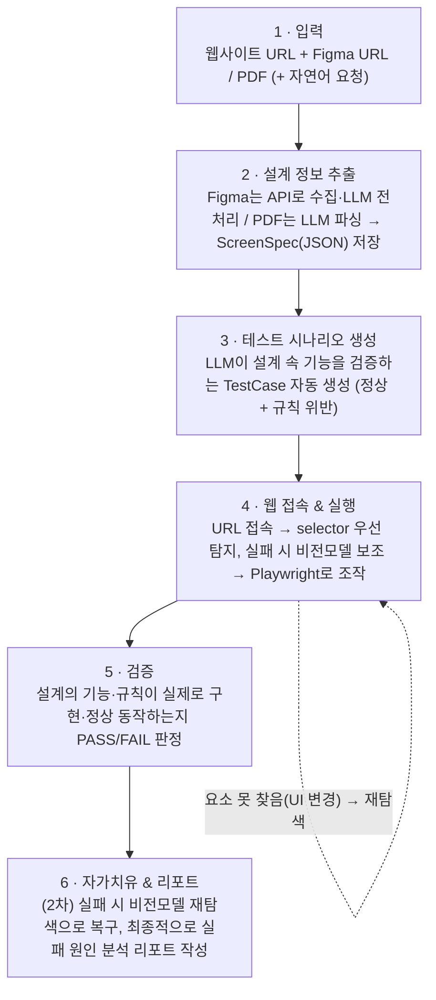
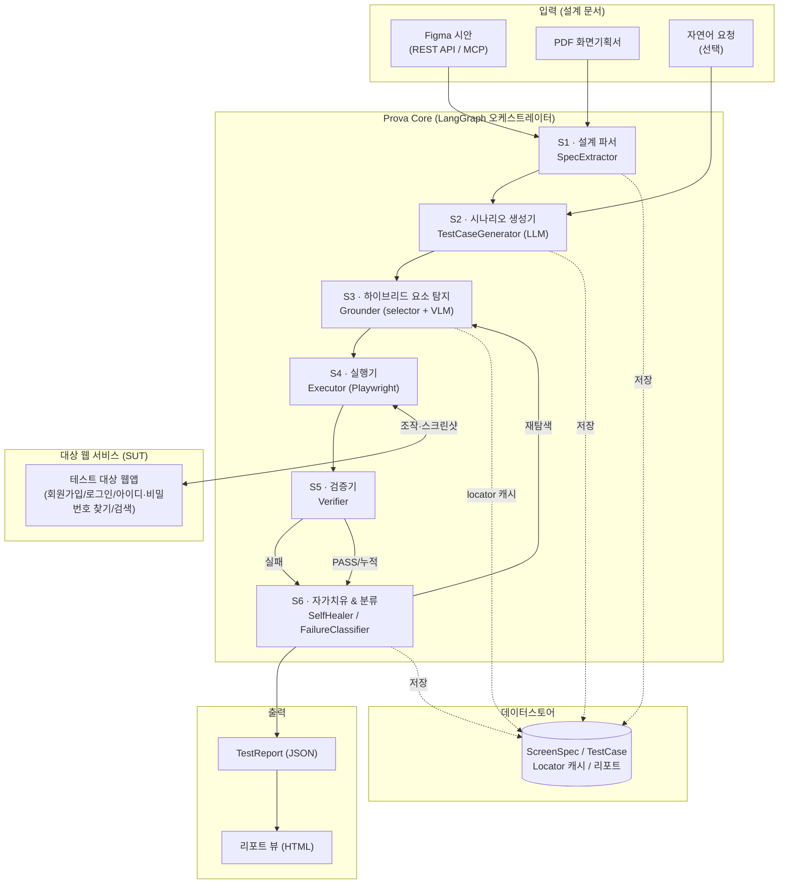
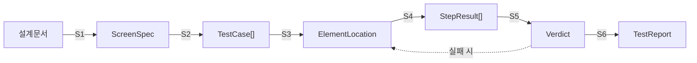
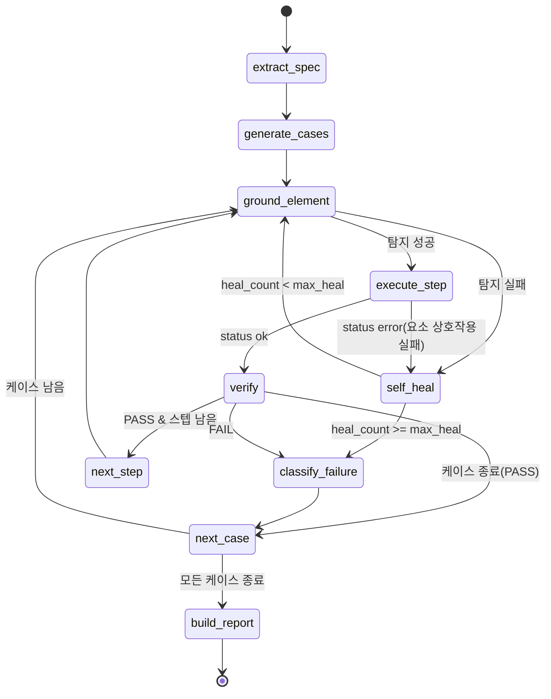
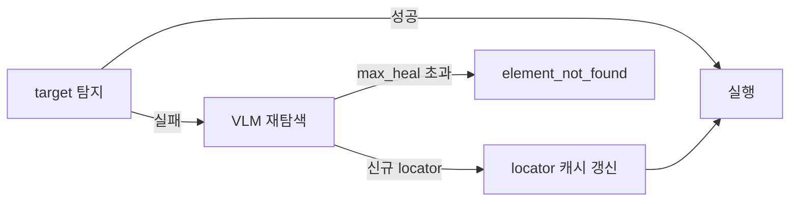
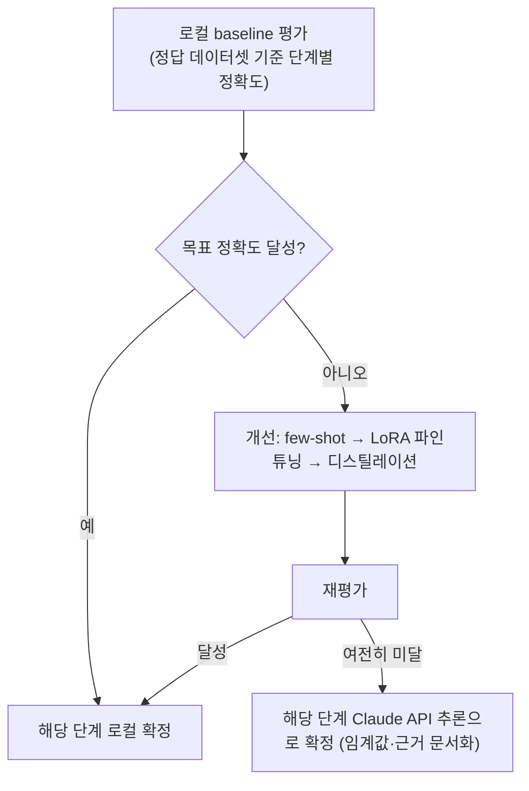

# Prova(프로바) — 서비스 명세서

> 설계 문서 기반 Vision-Language 웹 GUI QA Agent
> 팀 소인배 · 2026 하반기 WE-Meet · 개발 실무용 명세서 (v1.0)

---

## 0. 문서 개요

### 0-1. 목적
본 문서는 Prova의 **전체 파이프라인을 개발자가 그대로 구현할 수 있는 수준**으로 규정한다. 계획서가 "무엇을·왜"를 다룬다면, 본 명세서는 각 단계의 **입·출력 데이터 구조, 모듈 인터페이스, 에이전트 상태·노드, 실패 처리, 실제 워크스루**를 정의한다.

### 0-2. 적용 범위
| 구분 | 범위 |
|---|---|
| **1차 (핵심)** | 설계 정보 추출 → 테스트 시나리오 생성 → 요소 탐지 → 실행 → 검증 → 리포트 (회원가입·로그인·아이디/비밀번호 찾기·검색). **입력 검증 규칙**(예: 비밀번호 복잡도)이 구현에 반영됐는지 확인 포함 |
| **2차 (고도화)** | Self-Healing 재탐색, 실패 원인 자동 분류, 대상 확장(상품등록·주문조회) |

### 0-3. 용어 정의
| 용어 | 정의 |
|---|---|
| **ScreenSpec** | 설계 문서에서 추출한 화면 단위 명세(화면명·UI요소·조건). S1의 출력. |
| **TestCase** | 하나의 검증 시나리오(단계 목록·입력·기대결과). S2의 출력. |
| **Grounding** | 화면 스크린샷/DOM에서 UI 요소의 실제 위치(좌표·selector)를 확보하는 것. S3. |
| **Self-Healing** | UI 변경으로 기존 locator가 실패했을 때, VLM으로 요소를 재탐색해 테스트를 이어가는 것. |
| **Verdict** | 한 테스트 케이스의 PASS/FAIL 판정과 근거. S5의 출력. |
| **TestReport** | 실행 전체의 최종 리포트. S6의 출력. |

### 0-4. 문서 버전
- v1.0 (2026-하반기 착수). 이후 구현 진행에 따라 스키마 필드 확정·갱신.

---

## 1. 서비스 개요 & 아키텍처

### 1-1. 한 줄 정의
> **설계 문서(Figma/PDF)를 읽어 테스트를 스스로 생성하고, 화면을 사람처럼 인식(VLM)하여 검증하며, UI가 바뀌어도 요소를 재탐색해 테스트를 이어가는 자율 웹 GUI QA 에이전트.**

### 1-2. 핵심 가치
1. **설계 문서 연동** — 구현이 설계 요구사항대로 동작하는지 시험(prova)해 증명
2. **Vision 기반 인식** — DOM에 의존하지 않고 렌더링된 화면 자체를 인식 → UI 변경에 강건
3. **Self-Healing** — locator가 깨져도 재탐색하여 유지보수 부담 최소화

### 1-3. 전체 흐름 (사용자 관점 6단계)
사용자가 웹사이트 URL과 설계 문서를 입력한 뒤, 내부에서 다음 순서로 자동 진행된다.



| 단계 | 사용자 관점 설명 | 명세서 매핑 |
|---|---|---|
| **1. 입력** | 개발한 웹사이트 URL + 그 사이트를 만든 Figma 프로젝트 URL 또는 PDF 설계 문서를 입력 (선택: 자연어 요청) | 사용자 입력 |
| **2. 설계 정보 추출** | Figma는 API로 화면·요소 정보를 가져와 LLM으로 전처리, PDF는 LLM으로 기능을 추출 → 테스트할 기능/규칙을 `ScreenSpec`(JSON)으로 저장 | S1 |
| **3. 시나리오 생성** | LLM이 설계 문서에 적힌 기능들을 검증하는 테스트 시나리오를 생성 (정상 케이스 + 비밀번호 복잡도 등 규칙 위반 케이스) | S2 |
| **4. 웹 접속 & 실행** | 웹사이트 URL에 접속 → **selector로 우선 컴포넌트 탐지, 못 찾으면 비전모델로 보조 탐지** → Playwright로 실제 클릭·입력 실행 | S3 + S4 |
| **5. 검증** | 설계 문서의 기능·규칙이 실제 구현에 **모두·정상적으로** 반영됐는지 PASS/FAIL로 판정 | S5 |
| **6. 자가치유 & 리포트** | *(2차 고도화)* 실행 중 UI 변경으로 요소를 못 찾으면 비전모델 재탐색으로 **복구(자가치유)**, 마지막에 실패 원인 분석을 담은 **리포트** 작성 | S6 |

> 💡 **자가치유는 "성공했을 때"가 아니라 "실패(UI 변경으로 요소 미탐지) 순간"에 발동하는 복구 기능**이며(4단계 실행 루프에 끼어듦), **리포트는 항상 마지막**에 생성된다. 자가치유 자체는 1차 핵심 파이프라인이 동작한 뒤 구현하는 2차 목표다.

### 1-4. 전체 시스템 아키텍처



### 1-5. 데이터 플로우 (파이프라인 체인)


> 각 단계의 출력 타입이 다음 단계 입력으로 그대로 이어진다(§3 데이터 모델에서 타입 정합성 규정).

### 1-6. 기술 스택

| 레이어 | 도구/모델 | 역할 |
|---|---|---|
| 설계 문서 추출 | Figma REST API, Figma MCP, PDF 파서(pdfplumber 등) | 화면 요소·좌표·조건 구조화 |
| Vision Grounding | **LocateAnything-3B** (VLM) | 스크린샷 기반 GUI 요소 좌표 탐지 |
| 에이전트 | **LangGraph** | 상태 기반 워크플로우(감지·재시도·분기·메모리) |
| LLM | 대형언어모델(예: Claude/LLM 계열) | 시나리오 생성, 실패 원인 분류 |
| 테스트 실행 | **Playwright (Python)** | 브라우저 조작·검증·스크린샷 |
| 저장/버전 | JSON 파일 또는 경량 DB, Git/GitHub | 산출물 저장, 협업 |

---

## 2. 파이프라인 상세 (6단계)

> 각 단계는 **목적 / 입력 / 처리 로직 / 출력 / 사용 모듈 / 실패·에러 처리** 로 규정한다. 스키마 상세는 §3 참조.

### S1. 설계 정보 추출 — `SpecExtractor`
- **목적**: 설계 문서에서 화면 단위 명세(`ScreenSpec`)를 구조화 추출.
- **입력**: Figma 파일 키/노드 ID(REST API·MCP) 또는 PDF 경로.
- **처리 로직**:
  1. Figma: `GET /v1/files/{key}` 로 프레임·레이어·텍스트·컴포넌트·absoluteBoundingBox 수집.
  2. PDF: 텍스트/레이아웃 파싱으로 화면명·필드·버튼·문구 추출.
  3. 요소를 `UIElement`로 정규화(type·label·hint·required 등), 화면별 성공/실패조건·에러메시지 정리.
  4. LLM 보조 파싱(선택): 자유서술 기획 텍스트에서 조건을 구조화.
- **출력**: `ScreenSpec` (1화면 = 1객체).
- **사용 모듈**: `figma_client`, `pdf_parser`, `spec_normalizer`.
- **실패·에러 처리**: API 인증 실패 → 재시도/토큰 오류 반환; 파싱 불가 화면 → `warnings[]`에 기록하고 부분 결과 유지.

**입력 예시(Figma 노드 요약)** → **출력 `ScreenSpec` 예시**:
```json
{
  "screen_id": "signup",
  "screen_name": "회원가입",
  "url_path": "/signup",
  "elements": [
    {"element_id": "email", "type": "input", "label": "이메일", "required": true,
     "constraints": {"format": "email"}, "error_message": "올바른 이메일을 입력하세요."},
    {"element_id": "password", "type": "input", "label": "비밀번호", "required": true,
     "constraints": {"min_length": 8, "require_uppercase": 1, "require_special": 1},
     "error_message": "비밀번호는 8자 이상이며 대문자·특수문자를 각 1자 이상 포함해야 합니다."},
    {"element_id": "signup_btn", "type": "button", "label": "가입하기"}
  ],
  "success_condition": "가입 완료 토스트 '회원가입이 완료되었습니다' 노출 또는 /login 이동",
  "failure_conditions": ["필수값 누락 시 에러메시지 노출", "비밀번호 복잡도 규칙 위반 시 에러메시지 노출", "중복 이메일 시 경고"],
  "warnings": []
}
```
> **입력 검증 규칙(constraints)이 핵심.** 위 `require_uppercase`/`require_special`처럼 설계에 정의된 규칙은 S2에서 **규칙별 위반 케이스(negative)**로 전개되어, 구현이 규칙을 실제로 강제하는지 검증한다. (`constraints` 지원 키 예: `format`, `min_length`, `max_length`, `require_uppercase`, `require_lowercase`, `require_digit`, `require_special`, `pattern`)

### S2. 테스트 시나리오 생성 — `TestCaseGenerator` (LLM)
- **목적**: `ScreenSpec`(+자연어 요청)을 실행 가능한 `TestCase[]`로 변환.
- **입력**: `ScreenSpec`, (선택) 자연어 지시("회원가입 정상/실패 케이스 만들어줘").
- **처리 로직**:
  1. LLM 프롬프트에 ScreenSpec을 주입, **정상(happy) + 경계/실패(negative)** 케이스를 생성.
  2. **규칙별 negative 전개**: 각 `UIElement.constraints`의 규칙 하나하나에 대해 그 규칙을 **위반하는 입력값**과 **기대 에러메시지**를 자동 생성한다. 예) `require_uppercase` → 대문자 없는 값 입력 → 에러 노출 기대, `require_special` → 특수문자 없는 값 입력 → 에러 노출 기대. 이렇게 하면 "설계에 정의된 검증 로직이 구현에 실제로 반영됐는지"를 규칙 단위로 확인할 수 있다.
  3. 각 케이스를 `TestStep[]`(action·target·value·expected)로 구조화.
  4. 스키마 검증(JSON schema/pydantic)으로 LLM 출력의 형식 오류 교정(재요청 루프).
- **출력**: `TestCase[]` (정상 1 + 규칙별 위반 N).
- **사용 모듈**: `llm_client`, `prompt_templates`, `schema_validator`.
- **실패·에러 처리**: LLM 출력 스키마 위반 → 자동 재프롬프트(최대 N회); 필수 필드 누락 케이스는 폐기하고 로그.

**정상 케이스(규칙 충족)**:
```json
{
  "case_id": "signup-valid-001",
  "screen_id": "signup",
  "title": "정상 회원가입 (규칙 충족)",
  "type": "positive",
  "steps": [
    {"seq": 1, "action": "navigate", "target": "/signup"},
    {"seq": 2, "action": "fill", "target": "이메일", "value": "user@test.com"},
    {"seq": 3, "action": "fill", "target": "비밀번호", "value": "Abcd123!"},
    {"seq": 4, "action": "click", "target": "가입하기"}
  ],
  "expected": {"type": "toast_or_redirect", "value": "회원가입이 완료되었습니다"}
}
```

**규칙 위반 케이스(비밀번호 복잡도 검증)** — 대문자·특수문자 누락 입력 → 구현이 규칙을 강제하면 에러 노출(PASS), 그냥 가입되면 규칙 미반영(FAIL):
```json
{
  "case_id": "signup-pw-no-upper-002",
  "screen_id": "signup",
  "title": "비밀번호 규칙 위반 - 대문자·특수문자 없음",
  "type": "negative",
  "violates": "require_uppercase, require_special",
  "steps": [
    {"seq": 1, "action": "navigate", "target": "/signup"},
    {"seq": 2, "action": "fill", "target": "이메일", "value": "user@test.com"},
    {"seq": 3, "action": "fill", "target": "비밀번호", "value": "abcd1234"},
    {"seq": 4, "action": "click", "target": "가입하기"}
  ],
  "expected": {"type": "error_message",
    "value": "비밀번호는 8자 이상이며 대문자·특수문자를 각 1자 이상 포함해야 합니다."}
}
```

### S3. 요소 탐지 (Grounding) — `Grounder` (하이브리드)
- **목적**: `TestStep.target`(자연어 라벨)을 실제 조작 가능한 위치(`ElementLocation`)로 변환.
- **입력**: 현재 페이지 상태(DOM + 스크린샷), `TestStep.target`, `UIElement` 힌트.
- **처리 로직** (§5 상세):
  1. **selector-first**: DOM에서 label/role/text/placeholder 기반 후보 탐색(Playwright `get_by_*`).
  2. 단일 확정 실패(0개/다수/보이지 않음) → **VLM fallback**: 스크린샷을 LocateAnything-3B에 질의 → bbox 획득 → 좌표를 DOM 요소로 역매핑.
  3. 성공한 locator를 캐시에 저장(재사용·self-heal 근거).
- **출력**: `ElementLocation` (selector 또는 bbox·confidence·method).
- **사용 모듈**: `dom_locator`, `vlm_grounder`, `locator_cache`.
- **실패·에러 처리**: selector·VLM 모두 실패 → `GroundingError` → S6 self-heal 트리거(재탐색), 초과 시 `element_not_found`.

```json
{
  "target": "가입하기",
  "method": "vlm",
  "selector": "role=button[name='가입']",
  "bbox": [612, 840, 128, 44],
  "confidence": 0.93,
  "healed": true
}
```

### S4. 테스트 실행 — `Executor` (Playwright)
- **목적**: `TestStep`을 실제 브라우저에서 수행.
- **입력**: `TestStep`, `ElementLocation`, Playwright `Page`.
- **처리 로직**: action별 실행(`navigate`/`fill`/`click`/`select`/`wait`) → 각 스텝 후 스크린샷·DOM 스냅샷 캡처.
- **출력**: `StepResult[]`.
- **사용 모듈**: `playwright_driver`, `screenshot_store`.
- **실패·에러 처리**: 요소 미상호작용(가림·비활성)·타임아웃 → `StepResult.status='error'`, 원인코드 부착 → S5/S6로 전달.

```json
{
  "seq": 4, "action": "click", "target": "가입하기",
  "status": "ok", "elapsed_ms": 320,
  "screenshot": "runs/signup-valid-001/step4.png",
  "dom_snapshot": "runs/signup-valid-001/step4.html"
}
```

### S5. 결과 검증 — `Verifier`
- **목적**: 케이스의 `expected`와 실제 최종 상태를 대조해 PASS/FAIL 판정.
- **입력**: `TestCase.expected`, `StepResult[]`, 최종 페이지 상태.
- **처리 로직**: 기대 유형별 검증(텍스트 노출/URL 이동/에러메시지 매칭/토스트). 근거(evidence: 스크린샷·매칭 텍스트) 부착.
- **출력**: `Verdict` (PASS/FAIL + evidence).
- **사용 모듈**: `assertion_engine`.
- **실패·에러 처리**: 기대 불충족 → `FAIL` + 원인 후보 전달(S6 분류 입력).

```json
{
  "case_id": "signup-valid-001",
  "verdict": "PASS",
  "evidence": {"matched": "회원가입이 완료되었습니다", "screenshot": "runs/.../final.png"}
}
```

### S6. 자가치유 & 리포트 — `SelfHealer` / `FailureClassifier` / `ReportBuilder`
- **목적**: 실패를 복구(재탐색·재시도)하거나, 복구 불가 시 원인 분류 후 전체 리포트 생성.
- **입력**: `GroundingError`/`Verdict(FAIL)`, `AgentState`(재시도 카운트).
- **처리 로직**:
  1. **Self-Heal**: grounding 실패면 VLM 재탐색 → 새 locator로 S3~S5 재실행(최대 `max_heal` 회).
  2. **분류**: 최종 실패면 `FailureClassifier`(규칙 + LLM 보조)로 `FailureCategory` 부여(§6).
  3. **집계**: 모든 케이스 `Verdict` 누적 → `TestReport` 생성.
- **출력**: `TestReport`.
- **사용 모듈**: `self_healer`, `failure_classifier`, `report_builder`.
- **실패·에러 처리**: 치유 한도 초과 → 해당 케이스 FAIL 확정·원인 기록, 파이프라인은 다음 케이스 계속.

---

## 3. 데이터 모델

> Python 타입힌트(pydantic/TypedDict 스타일)로 규정. 실제 저장은 JSON.

```python
from typing import TypedDict, Literal, Optional

class UIElement(TypedDict):
    element_id: str
    type: Literal["input", "button", "link", "select", "checkbox", "text"]
    label: str
    required: bool
    constraints: dict          # 검증 규칙. 예: {"format":"email", "min_length":8,
                               #   "require_uppercase":1, "require_special":1, "pattern":"..."}
    error_message: Optional[str]

class ScreenSpec(TypedDict):
    screen_id: str
    screen_name: str
    url_path: str
    elements: list[UIElement]
    success_condition: str
    failure_conditions: list[str]
    warnings: list[str]

class TestStep(TypedDict):
    seq: int
    action: Literal["navigate", "fill", "click", "select", "wait", "assert"]
    target: str                # 자연어 라벨 (S3에서 grounding)
    value: Optional[str]
    expected: Optional[dict]

class TestCase(TypedDict):
    case_id: str
    screen_id: str
    title: str
    type: Literal["positive", "negative", "boundary"]
    violates: Optional[str]    # negative일 때 위반 규칙(예: "require_uppercase")
    steps: list[TestStep]
    expected: dict             # {"type": "toast_or_redirect"|"error_message"|"redirect", "value": "..."}

class ElementLocation(TypedDict):
    target: str
    method: Literal["selector", "vlm"]
    selector: Optional[str]
    bbox: Optional[list[int]]  # [x, y, w, h]
    confidence: float
    healed: bool

class StepResult(TypedDict):
    seq: int
    action: str
    target: str
    status: Literal["ok", "error"]
    elapsed_ms: int
    screenshot: Optional[str]
    dom_snapshot: Optional[str]
    error_code: Optional[str]

class Verdict(TypedDict):
    case_id: str
    verdict: Literal["PASS", "FAIL"]
    evidence: dict
    failure_category: Optional[str]   # FAIL일 때 §6

class TestReport(TypedDict):
    run_id: str
    target_url: str
    summary: dict              # {"total": 10, "pass": 8, "fail": 2, "healed": 3}
    cases: list[Verdict]
    created_at: str
```

**`FailureCategory` (enum)** — §6 참조:
`element_not_found` · `input_error` · `assertion_mismatch` · `timeout` · `page_error` · `unknown`

---

## 4. LangGraph 에이전트 설계

### 4-1. AgentState (TypedDict)
```python
class AgentState(TypedDict):
    # 입력/산출물
    spec: ScreenSpec
    cases: list[TestCase]
    current_case_idx: int
    current_step_idx: int
    location: Optional[ElementLocation]
    step_results: list[StepResult]
    verdicts: list[Verdict]
    # 제어
    heal_count: int            # 현재 스텝 self-heal 시도 횟수
    retry_count: int
    max_heal: int              # 기본 2
    max_retry: int             # 기본 1
    # 출력
    report: Optional[TestReport]
    errors: list[str]
```

### 4-2. 노드(Node) 목록
| 노드 | 책임 | 입력 → 출력(state 갱신) |
|---|---|---|
| `extract_spec` | 설계 문서 → ScreenSpec | 문서 → `spec` |
| `generate_cases` | ScreenSpec → TestCase[] | `spec` → `cases` |
| `ground_element` | 현재 step.target → ElementLocation | `cases[idx].steps[j]` → `location` |
| `execute_step` | Playwright 조작 | `location` → `step_results` append |
| `verify` | expected 대조 | `step_results` → `verdicts` append |
| `self_heal` | VLM 재탐색 후 재시도 | `location(healed)` , `heal_count++` |
| `classify_failure` | 실패 원인 분류 | `verdicts[-1].failure_category` |
| `build_report` | 전체 집계 | `verdicts` → `report` |

### 4-3. 그래프 (노드·엣지·조건 분기)


> `next_step` / `next_case` 는 인덱스 증가만 수행하는 라우팅 노드(또는 조건부 엣지 함수)로 구현.

### 4-4. 재시도·종료 조건
- **self-heal**: 스텝당 `heal_count < max_heal`(기본 2) 동안만 재탐색. 초과 시 `element_not_found` 확정.
- **execute 재시도**: 일시적 오류(타임아웃 등)는 `retry_count < max_retry`(기본 1)까지 재실행.
- **종료**: 모든 케이스의 `Verdict` 확정 → `build_report` → 그래프 종료.

---

## 5. 하이브리드 요소 탐지 & Self-Healing 전략

### 5-1. 탐지 우선순위 (selector-first)
1. `get_by_role(name=...)` (접근성 이름)
2. `get_by_label` / `get_by_placeholder` (폼 필드)
3. `get_by_text` (버튼·링크 텍스트)
4. 캐시된 locator (이전 실행 성공분)

→ **정확히 1개 & 가시성 확보** 시 확정. 0개·다수·비가시 → VLM fallback.

### 5-2. VLM Fallback (LocateAnything-3B)
- 입력: 현재 뷰포트 스크린샷 + 프롬프트("‘가입하기’ 버튼 위치").
- 출력: bbox → 뷰포트 좌표의 DOM 요소로 역매핑(`page.mouse` 좌표 클릭 또는 elementFromPoint).
- `confidence` 임계값(기본 0.5) 미만이면 실패 처리.

### 5-3. Self-Healing 루프

- 성공적으로 치유된 locator는 캐시에 **갱신 저장**하여 다음 실행부터 selector-first가 바로 성공(재치유 비용 절감).
- `Verdict.healed`/`ElementLocation.healed=true`로 표시 → Self-Healing 복구율 지표(§9) 산출 근거.

---

## 6. 실패 원인 자동 분류

| FailureCategory | 판정 규칙(요약) | 예시 근거 |
|---|---|---|
| `element_not_found` | selector·VLM 모두 실패 & max_heal 초과 | grounding 로그 |
| `input_error` | 입력 후 필드 검증 에러메시지 노출(설계상 정상값인데 거부) | 에러 토스트 텍스트 |
| `assertion_mismatch` | 실행은 완료됐으나 expected 불일치 | 기대/실제 텍스트 diff |
| `timeout` | 네비게이션/요소 대기 시간 초과 | Playwright timeout |
| `page_error` | 4xx/5xx, JS 콘솔 예외, 빈 페이지 | 응답 코드·콘솔 로그 |
| `unknown` | 위 규칙 미해당 | LLM 보조 분류 |

- **판정 방식**: 규칙 기반 우선 → 미해당 시 LLM에 `StepResult`+스크린샷 요약을 주어 분류(provider-agnostic).
- 결과는 `Verdict.failure_category`와 `TestReport`에 기록.

---

## 7. 예시 시나리오 워크스루 — 회원가입 E2E (Self-Healing 포함)

**상황**: 설계 문서상 "가입하기" 버튼이 있었으나, 실제 구현에서 개발자가 클래스명을 `#submit`→`#signup-submit`으로 바꿔 selector가 깨진 상태.

1. **S1**: Figma에서 `ScreenSpec(signup)` 추출 (§2-S1 예시).
2. **S2**: LLM이 `signup-valid-001`(정상) 케이스 생성 (§2-S2 예시).
3. **S3 (step4 '가입하기')**: selector-first 시도 → 기존 캐시 `#submit` 매칭 0개 → **탐지 실패**.
4. **self_heal**: 스크린샷을 LocateAnything-3B에 질의 → bbox `[612,840,128,44]`, confidence 0.93 → 좌표 역매핑으로 `role=button[name='가입']` 확보 → **locator 캐시 갱신**, `healed=true`.
5. **S3 재실행 → S4**: 새 locator로 클릭 성공(`StepResult.status=ok`).
6. **S5**: 최종 화면에 "회원가입이 완료되었습니다" 토스트 확인 → **Verdict=PASS** (`healed=true`).
7. **S6 build_report**: 케이스 집계 → `TestReport` 생성.

**최종 `TestReport` 예시**:
```json
{
  "run_id": "run-20260917-001",
  "target_url": "https://demo.app",
  "summary": {"total": 1, "pass": 1, "fail": 0, "healed": 1},
  "cases": [
    {"case_id": "signup-valid-001", "verdict": "PASS",
     "evidence": {"matched": "회원가입이 완료되었습니다", "screenshot": "runs/.../final.png"},
     "failure_category": null}
  ],
  "created_at": "2026-09-17T14:03:11+09:00"
}
```
> UI가 바뀌었음에도 사람 개입 없이 테스트가 **자가치유되어 통과**했다 — Prova의 핵심 가치를 그대로 보여주는 흐름.

---

## 8. 리포트 명세

### 8-1. TestReport 필드
| 필드 | 설명 |
|---|---|
| `run_id` | 실행 식별자 |
| `target_url` | 테스트 대상 URL |
| `summary` | `{total, pass, fail, healed}` 집계 |
| `cases[]` | 케이스별 `Verdict`(PASS/FAIL·evidence·failure_category) |
| `created_at` | 실행 시각(ISO8601) |

### 8-2. 리포트 뷰(HTML) 구성
- 상단 요약 카드(총/통과/실패/치유 건수, 통과율)
- 케이스 테이블(제목·결과·실패원인·소요시간·스크린샷 링크)
- 실패 케이스 상세(기대 vs 실제, 스크린샷, 실패 분류)
- (계획서 산출물 "리포트 생성기"와 연결: 실행 로그·입력·기대·실제·실패원인 포함)

---

## 9. 성능 지표 & 평가 (계획서 4-6 연계)

| 지표 | 정의 | 측정 방법 | 목표 |
|---|---|---|---|
| GUI 요소 탐지 성공률 | 정답 좌표 대비 정확 탐지 비율(IoU 기준) | 정답 bbox 데이터셋과 비교 | ≥ 90% |
| PASS/FAIL 판단 정확도 | 정답 라벨 대비 판정 일치율 | 라벨링된 케이스셋 | ≥ 90% |
| 테스트 케이스 생성 품질 | 설계 요구사항(입력·성공조건) 반영 정확도 | 사람 검수/루브릭 | 정성 평가 |
| Self-Healing 복구율 | UI 변형 후 재탐색 통과 비율 | 변경 전/후 통과율 비교(`healed`) | 정량 측정 |
| 리포트 완결성 | 로그·입력·기대·실제·원인 포함 여부 | 필드 체크리스트 | 100% |

- selector 방식 vs VLM 방식의 **탐지 성공률·처리 속도**를 별도 비교 측정(하이브리드 근거).
- **로컬 모델 vs Claude API**의 단계별(S1·S2·S6) 추출/생성 정확도를 정답 데이터셋으로 비교 측정 → §10-4 배치 결정의 근거로 사용.

---

## 10. 모델 운영 전략 (로컬 우선 · 평가 → 개선 → API fallback)

### 10-1. 원칙
WE-Meet의 취지(학생 주도 AI 기술 내재화)와 B2B QA 도구의 데이터 프라이버시 요구에 맞춰, **로컬 소형 모델을 기본값으로 삼고, Claude API는 로컬이 목표 정확도에 미치지 못하는 단계에 한해 fallback**으로 사용한다. 이미 GUI 요소 탐지(S3)를 로컬 VLM(LocateAnything-3B)으로 수행하므로, 전처리·생성용 LLM도 로컬에 co-locate하여 온프레미스 QA 에이전트로서의 정체성을 일관되게 유지한다.

### 10-2. 단계별 배치 판단
| 단계 | 1차 판단 | 근거 |
|---|---|---|
| S1 Figma 추출 | 🟢 로컬 | Figma API가 구조화 JSON 제공 → 매핑 작업. 소형 모델 + 제약 디코딩으로 충분 |
| S6 실패 분류 | 🟢 로컬 | 고정 카테고리 분류 = 소형 모델 파인튜닝의 강점 |
| S2 표준 케이스(규칙→위반) | 🟢 로컬 유력 | 규칙→위반 매핑은 거의 결정적 패턴 |
| 자연어 요청 해석 | 🟡 로컬 시도(경계) | 자유 발화 변동성 큼 → 파인튜닝 후 정확도로 판단 |
| S1 PDF 추출 | 🔴 API 후보 | 시각적 레이아웃·자유서술 → 강한 멀티모달 추론 필요 |
| S2 복잡·모호 명세의 엣지케이스 | 🔴 API 후보 | 비자명한 케이스 커버리지 = 강한 모델 우위 |

> 위 판단은 **가설**이며, §10-4 워크플로우의 정량 평가로 단계별 배치를 확정한다.

### 10-3. 로컬 성능 향상 방법
1. **few-shot + 제약 디코딩(constrained decoding)** — vLLM `guided_json` / llama.cpp GBNF 문법 / Outlines로 JSON 스키마 강제(정형 출력과 동일 역할)로 베이스라인 확보.
2. **LoRA/QLoRA 파인튜닝** — §4-2에서 구축하는 정답(Ground-Truth) 데이터셋을 학습 데이터로 재사용.
3. **디스틸레이션(Distillation)** — 어려운 단계는 **Claude API로 gold 라벨을 대량 생성** → 그 데이터로 로컬 소형 모델을 파인튜닝. *API는 학습 데이터 부트스트랩에만 쓰고 추론은 로컬로* 수행하여 추론 시 API 의존도를 최소화한다.
4. 그래도 목표 미달이면 **더 큰 로컬 모델** 또는 해당 단계만 **API 추론**으로 확정.

- 후보 로컬 모델(예): Qwen2.5-3B/7B-Instruct, Llama-3.2-3B 급 instruct 모델(경량·JSON 지시 준수). 부트스트랩/부족 단계 API(예): Claude 계열.

### 10-4. 의사결정 워크플로우


### 10-5. 구현 규격
- **`llm_client` 추상화**: 모든 LLM 호출(S1·S2·S6)은 공통 인터페이스(`extract_spec()`, `generate_cases()`, `classify_failure()`)를 통해 이뤄지며, **백엔드(로컬 vs Claude API)를 단계별로 코드 수정 없이 교체** 가능하도록 설정으로 주입한다.
- 로컬·API 모두 **정형 출력**으로 §3 데이터 모델(ScreenSpec·TestCase 등)을 강제한다(로컬=제약 디코딩, API=structured outputs).

---

## 11. 향후 확장 (2차)

- **대상 기능 확장**: 상품 등록, 주문 조회 등 다중 화면·상태 전이 시나리오.
- **병렬 실행**: 케이스 단위 병렬화로 실행 시간 단축.
- **CI 연동**: GitHub Actions 등에서 PR마다 Prova 실행 → 회귀 검증 자동화.
- **locator 학습**: 반복 실행에서 치유 패턴을 축적해 selector-first 적중률 상향.

---

*본 명세서는 계획서(`하반기_계획서_초안.md`)의 6단계 파이프라인·기술스택·성과지표와 일관되게 작성되었으며, 구현 진행에 따라 스키마 필드가 확정·보완된다.*
